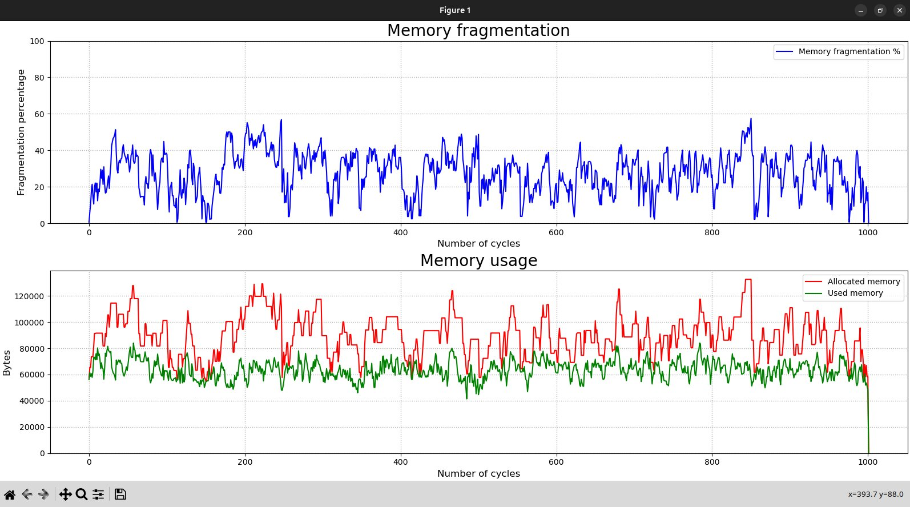

# myallocs

**memalloc** is an extremely simple memory allocator library.

It implements `mymalloc()`, `mycalloc()`, `myrealloc()` and `myfree()`.

## Why?

I wrote this library to improve my personal knowledge of the *C language*, *libc*, *system calls* and *memory allocators*.

## Requirements

- Linux operating system (could maybe work with Unix-like operating systems?)
- GNU Make (`make`)
- GNU GCC compiler (`gcc`, with `glibc` version >= 2.39)

To run the test, `python3` with `matplotlib` is necessary.

## Build

Use the following command inside the `myallocs/` directory:

```
make
```

The shared library `libmyallocs.so` should be present inside the created directory `build/`.

### Debug

If you want to debug, use the following command inside the `myallocs/` directory:

```
make debug
```

The shared library `libmyallocs_debug.so` should be present inside the created directory `build/`. This debug version is different from the normal one, because it defines the macro `MYALLOCS_DEBUG`, which compiles some extra debugging functions.

### Test

If you want to run the test, use the following command inside the `myallocs/` directory:

```
make test
```

The shared library `libmyallocs_debug.so` (as described in the section [Debug](#debug)) and the executable `test_myallocs` should be present inside the created directory `build/`.

Then, run the `test_myallocs`. This should print on `stdout` the *throughput*, and create (inside the working directory) 2 files: `data1.txt` and `data2.txt`, containing data regarding memory usage and fragmentation. It is possible to tweak how the test works. To do so, take a look inside the `test.c` file! 

To visualize the data of these 2 files, run the `plot.py` script (which will look for the `data1.txt` and `data2.txt` files, and create a plot using `matplotlib`) with the following command:

```
python3 plot.py
```

Something like this should appear:



I advice to do all these steps together with the following command:

```
make test && build/test_myallocs && python3 plot.py
```

### Extra

Inside the `Makefile`, it is described how it is possible to modify how the library functions will work by defining certain macros. The currently supported macros are the following:
- `MYALLOCS_BEST_FIT` = force the library functions to use the "BEST FIT" policy (instead of the standard "FIRST FIT" policy)
- `MYALLOCS_FULL_DEALLOC` = force the library functions to try to deallocate as much free memory as possible

## Resources

The resources that I used to create this software are the following:

- [arjunsreedharan.org - Memory Allocators 101 - Write a simple memory allocator](https://arjunsreedharan.org/post/148675821737/memory-allocators-101-write-a-simple-memory)
- [YouTube - cpp4arduino - What is heap fragmentation?](https://www.youtube.com/watch?v=_G4HJDQjeP8)
- [YouTube - Luis Ceze - Memory Allocation, Video 1: Introduction](https://www.youtube.com/watch?v=RSuZhdwvNmA)
